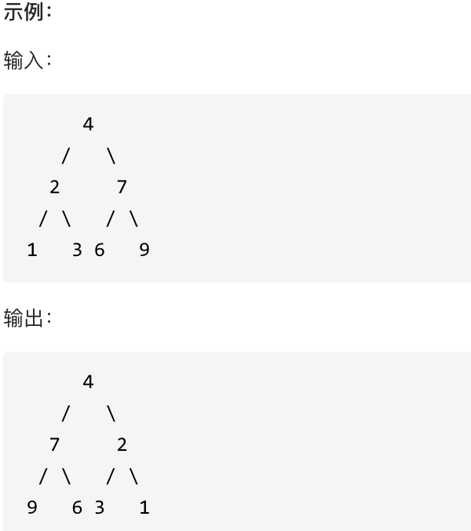

# 树

> 本章部分实验代码(ws/tree)

## 1.树的三种遍历

### 1. 递归法

> 递归需要明确两样事情，一个是终止条件，另一个是递归函数的参数和返回值，当二者都明确了，就可以确定单层递归的逻辑。

### 2. 迭代法

> 迭代的本质是利用栈和队列实现，递归中各项过程。通过给节点标记是否处理过的方式，可以很自然的将树的三种遍历的形式统一。

## 2. 树的层序遍历

通过层序遍历，来实现各种目的。

有以下题目：

* 102.二叉树的层序遍历
* 107.二叉树的层次遍历II
* 199.二叉树的右视图
* 637.二叉树的层平均值
* 429.N叉树的前序遍历
* 515.在每个树行中找最大值
* 116.填充每个节点的下一个右侧节点指针
* 117.填充每个节点的下一个右侧节点指针II
* 104.二叉树的最大深度
* 111.二叉树的最小深度
* 1609 .奇偶树

> 如果是三种常规遍历，采用的是栈来实现，这里采用的就是队列实现。通过将每一层所有的节点按照先进先出的规则存储起来，之后计算每层遍历次数，实现按照层次遍历。
>
> 其他的变化问题，只需要在遍历的过程中，插入相应的逻辑即可。

## 3.翻转二叉树

### 1. lcNo：226

题目：翻转一棵二叉树。

> 树的问题，根据相应的迭代方式，都可以采用递归或者迭代的思想来解决。

> 递归：首先确定递归方程：`reverseTree(root)=root+reverseTree(root->left)+reverseTree(root->right)`,根据递归方程确定递归关系，也就是函数的参数为树的根，返回值为左右子树。这里的终止条件必须与根一致，一开始的思路是当左右子树都为空时，返回本节点。但这个返回值的前提是，你不会将一个空指针作为参数，否则空指针是没有 `left`和 `right`，而首先root本身就可能为空，其次，如果二叉树也可能一颗子树为空。所以返回条件应该为本身为空。还有一点要注意的是，由于输入参数用的是当前节点的左右节点，因此只能先序遍历或者后序遍历，中序遍历会出现部分子树翻转两次的问题。
>
> 迭代：通过入栈的顺序来迭代更新树的左右子树，这里的迭代可以用统一迭代方式，也可以层序遍历。由于这里在翻转之初就将要迭代更新的左右子树作为输入参数压入栈中而确定，因此即使左右子树已经翻转，不会影响过程。因此迭代遍历是允许中序遍历的。
